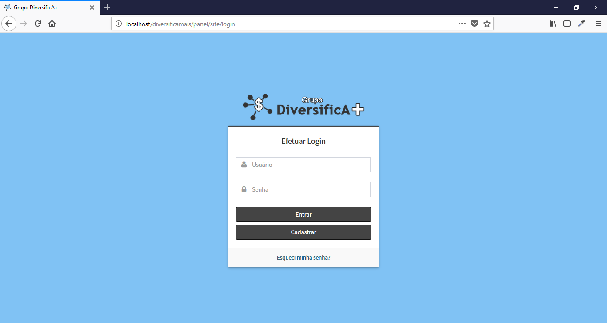
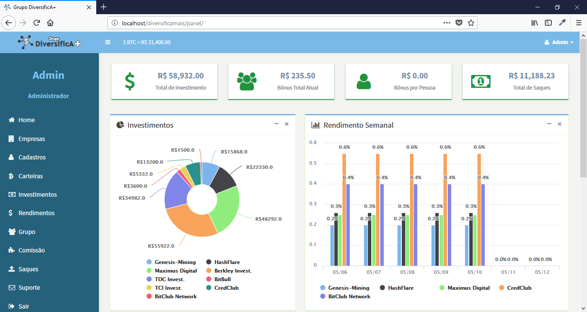
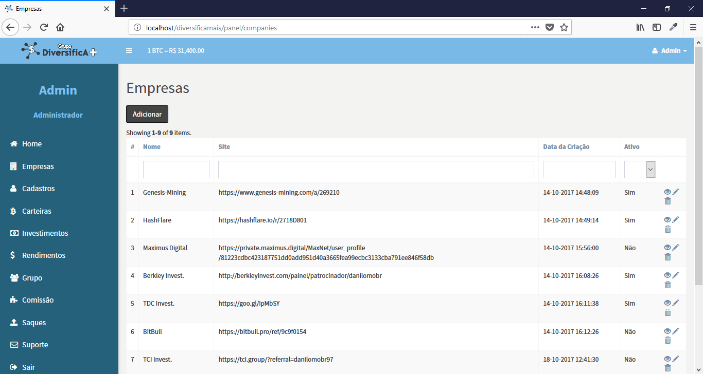
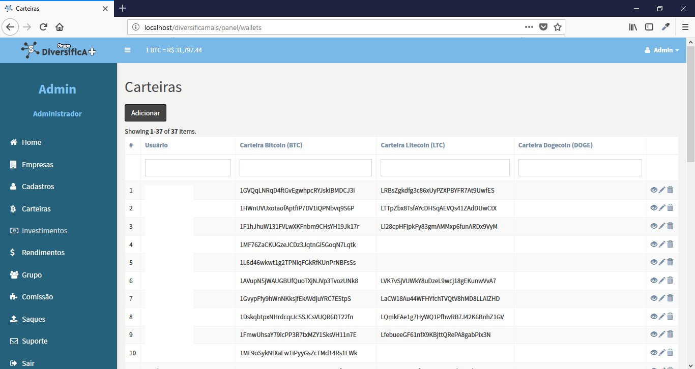
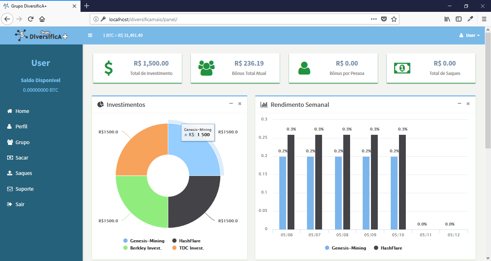
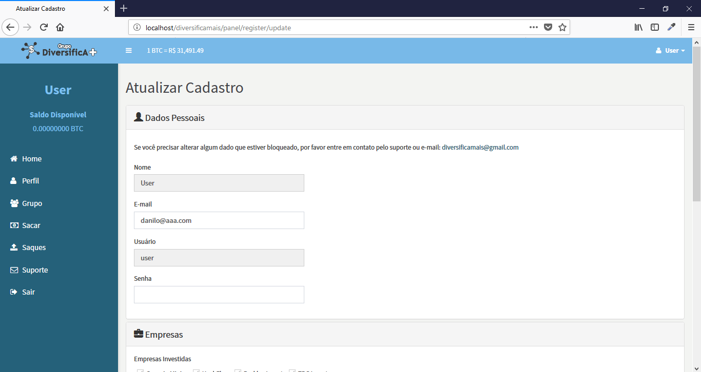
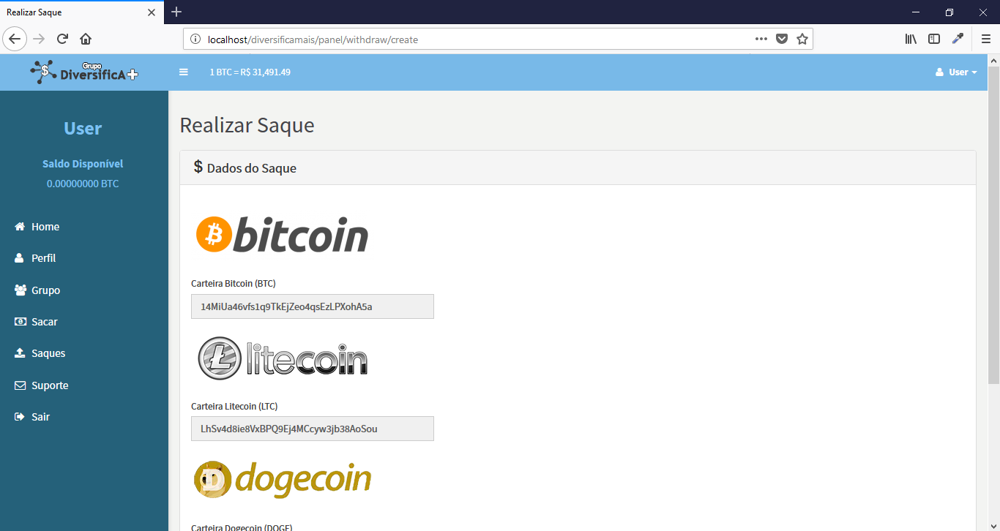

# DiversificA+

Sistema de pagamento em criptomoedas desenvolvido com o Framework Yii2 e banco de dados MySql.

## Características

- Auth
- Routes
- CRUD
- ORM
- Validation
- Grid View
- Filter
- Pagination
- HighCharts
- API Poloniex

## Tecnologias

- PHP 7
- JS
- Jquery
- Json
- CSS and SCSS
- Bootstrap
- Composer

## Instalação

```
$ git clone https://github.com/danilomeneghel/diversifica_inv.git

$ cd diversifica_inv

$ composer install
```

Crie um novo banco de dados com o nome "diversificainvestimentos".
Depois importe o banco de dados da pasta $db/diversificamaisinvestimentos.sql para o seu MySql.

Feito isso, abra no seu navegador http://localhost/diversifica_inv/panel

## Licença

DiversificA+ está licenciado por <a href="LICENSE.md">Yii Software LLC</a>.

## Screenshots

- ADMIN

<br><br>
<br><br>
<br><br>
<br><br>

- USER

<br><br>
<br><br>
<br><br>
